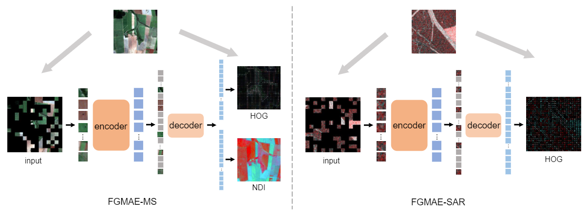

# FG-MAE
Feature guided masked Autoencoder for self-supervised learning in remote sensing

<p align="center">
  
</p>

PyTorch implementation of [FGMAE](). 

### Pretrained models

| modality  | ViT-Small  | ViT-Base | ViT-Large | ViT-Huge |
| :---: | :---: | :---: | :---: | :---: |
| 13 band MS | [ViT-S/16](https://huggingface.co/wangyi111/FGMAE/resolve/main/B13_vits16_fgmae_ep99.pth) | [ViT-B/16](https://huggingface.co/wangyi111/FGMAE/resolve/main/B13_vitb16_fgmae_ep99.pth) | [ViT-L/16](https://huggingface.co/wangyi111/FGMAE/resolve/main/B13_vitl16_fgmae_ep99.pth) | [ViT-H/14](https://huggingface.co/wangyi111/FGMAE/resolve/main/B13_vith14_fgmae_ep399.pth) |
| 2 band SAR | [ViT-S/16](https://huggingface.co/wangyi111/FGMAE/resolve/main/B2_vits16_fgmae_ep99.pth) | [ViT-B/16](https://huggingface.co/wangyi111/FGMAE/resolve/main/B2_vitb16_fgmae_ep99.pth) | [ViT-L/16](https://huggingface.co/wangyi111/FGMAE/resolve/main/B2_vitl16_fgmae_ep99.pth) | [ViT-H/14](https://huggingface.co/wangyi111/FGMAE/resolve/main/B2_vith14_fgmae_ep399.pth) |

### Pretraining
For FGMAE-MS, go to `src/pretrain_ssl`, and run
```
python pretrain_fgmae.py \
--root_dir /path/to/data \
--output_dir /path/to/checkpoints \
--log_dir /path/to/logs \
--model mae_vit_small_patch16 \
--mask_ratio 0.7 \
--num_workers 10 \
--batch_size 64 \
--epochs 100 \
--warmup_epochs 10 \
--input_size 224 \
--feature hog+ndi \
--blr 1.5e-4 \
--in_channels 13 \
--norm_pix_loss \
--hog_norm \
```

For FGMAE-SAR, modify `--in_channels 2` and `--feature hog`.

On one node in a slurm system with 4 GPUs, we provide some example job submission scripts in `src/scripts`.

### Transfer Learning
See `src/pretrain_ssl/transfer_classification` for linear probing and fine tuning on BigEarthNet and EuroSAT.

#### EuroSAT-SAR dataset
We collect a Sentinel-1 GSD SAR version of [EuroSAT]() by matching the coordinates. Please see [EuroSAT-SAR](https://huggingface.co/datasets/wangyi111/EuroSAT-SAR) for descriptions and downloads.

### License

This repository is heavily built on [MAE](https://github.com/facebookresearch/mae), which is under the Apache 2.0 License - see the [LICENSE](LICENSE) file for details.

